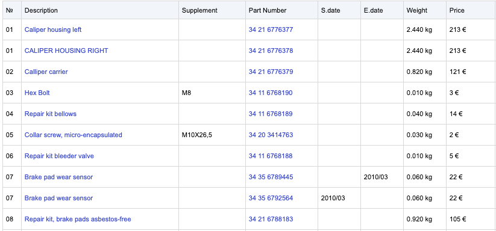

# Lab 6: Growing Domain Part 3

## New Domain Modules

Let's have a look on the introduced domain modules _GarageOrder_ and _PartsCatalogue_. Both domain modules depends on
the _Vehicle_ domain module.

In context of the garage order only the license plate and the VIN is relevant. For the parts catalogue only the vehicle
model and the domain value _has2GSupport_ is relevant.

See the garage order form for more details:


See also a sample explosion chart as central domain object of the parts catalogue:


Addtional the corresponding spare parts table.



## Design Dependencies Between Domain Modules

In traditional data-centric approach it is common to design the application around a centric data model. But we learned
that this leads to high coupling in the longterm. Sharing the domain objects can be a valid solution with the discussed
disadvantages.

In this lab we meet three alternative solution strategies to handle dependencies between domain modules.

## Task 6.1: Introduce the Use Case FetchVehicleByLicensePlate

1. Introduce a additional incoming use case in the domain module _vehicle_ with the name _FetchVehicleByLicensePlate_ that
   contains the following method:

```java
Vehicle fetchByLicensePlate(Vin vin);
```

2. Implement the use case by extending the _VehicleQueryService_
3. (Optional) Extend _VehicleDbQuery_ and _VehicleQueryRepository_ with the method _FindByLicensePlate(LicensePlate licensePlate)_

### Verify your Implementation

1. Move the tests _DomainRing_Task_6_1.java_ from _tutorial/lab/six_ to _
   src/test/java/com/hexaclean/arc/demo/lab/six_
2. Run _mvn clean install -DskipTests_
3. Execute _DomainRing_Task_6_1.java_

### Verify Your Architecture

Execute _ArchitectureTest_Task_6_1.java_

## Task 6.2: Implement the Adapter.Out - UseCase.In Pattern

Implement the adapter.out - usecase.in pattern between the domain module _garage order_ and _vehicle_.

1. Have a look at the outgoing use case _FetchVehicle_ in _garage/order/usecase/out_
2. Implement the output adapter with the name _VehicleModuleClient_ and a mapper with the name 
_VehicleToOriginVehicleMapper_.

### Verify your Implementation

1. Move the tests _OutputAdapter_Task_6_2.java_ from _tutorial/lab/six_ to _
   src/test/java/com/hexaclean/arc/demo/lab/six_
2. Run _mvn clean install -DskipTests_
3. Execute _OutputAdapter_Task_6_2.java_

### Verify Your Architecture

Execute _ArchitectureTest_Task_6_2.java_

## Task 6.3: Implement the Application Service Pattern

Implement the application service pattern between the domain module _parts catalogue_ and _vehicle_.

1. Have a look at the _ExplosionChartApplicationService_ in _parts/catalogue/appservice_ and notice the dependency to _
   VehicleQuery_ of the domain module vehicle.
2. Implement a mapper with the name _VehicleToOriginVehicleMapper_
3. Implement the use case _ExposionChartQuery_

### Verify your Implementation

1. Move the tests _ApplicationService_Task_6_3.java_ from _tutorial/lab/six_ to _
   src/test/java/com/hexaclean/arc/demo/lab/six_
2. Run _mvn clean install -DskipTests_
3. Execute _ApplicationService_Task_6_3.java_

### Verify Your Architecture

Execute _ArchitectureTest_Task_6_3.java_

## Clean Architecture ArchUnit Tests

1. Execute _CleanArchitectureTest.java_
2. Fix the test by extending the test _should_check_clean_architecture_all_rings_architectural_expressive_ with this two lines of code:

```java
        .adapterOutOfAdapterOutUseCaseInPattern("..garage.order.adapter.out..")
        .applicationService("..parts.catalogue.appservice..")
```
3. Execute _CleanArchitectureTest.java_ again


## Group Discussion: Use the Supporting Service Pattern Between Vehicle and Parts Catalogue

See _src/test/java/com/hexaclean/arc/demo/supporting/service/vehicle/masterdata_.